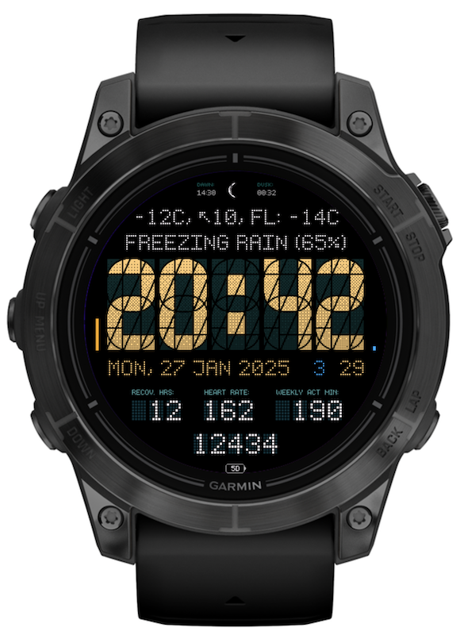

# Segment34 MkII
A watchface for Garmin watches with a 34 Segment display

The watchface features the following:

- Time displayed with a 34 segment display
- Phase of the moon with graphic display
- Heartrate or Respiration rate
- Weather (conditions, temperature and windspeed)
- Sunrise/Sunset
- Date
- Notification count
- Configurable: Active minutes / Distance / Floors / Time to Recovery / VO2 Max
- Configurable: Steps / Calories / Distance
- Battery days remaining (or percentage on some watches)
- Always on mode
- Settings in the Garmin app

## Frequently Asked Questions
https://github.com/ludw/Segment34mkII/blob/main/FAQ.md

## IQ Store Listing
https://apps.garmin.com/apps/aa85d03d-ab89-4e06-b8c6-71a014198593

## Buy me a coffee (if you want to)

## Contributing (code)
Pull requests are welcome, but please follow the following guidelines:
- For larger changes, **please open an issue first** and discuss what you have in mind.
- Keep PRs small, don't do a lot of different changes at once.
- Explain what you have changed and why.
- Only submit code you have actually run and tested (on all supported screen sizes).
- Remeber that watch faces has to be performant and memory efficient.
  Changes that significantly increase memory use or degrade performance will be rejected.
- For optimizations, please provide memory and profiler comparisons.
- Try to keep the code in the same style as the rest of the project.
   - Indent with four spaces.
   - local variables with snake_case.
   - function and global variables names with camelCase.
   - cache all properties.
   - use comments only when they add value.
     Explain things that look strange or values that has to be looked up to be understood.

 ## TODO / Things people have asked for
- Localization
- Adjustable font size
- Goal completion marker
- Pressure trend
- Race predictions
- Weather caching
- Monthly run/bike distance

## Change log
2025-04-14 v2.7.0
- Fixed issue with recovery time for some devices
- Fixed issue with night color theme not working if sleep time was after midnight

2025-04-12 v2.6.0
- AOD with outline as an option (Clock outline style)
- Option for two 4 digit fields in bottom field layout
- New custom color theme variant 3 with even more of the specified colors

2025-04-10 v2.5.1
- Changed API for Solar intensity
- Issue with empty spots in mixed weather values fixed thanks to debugloop
- Vivoactive 6 support added

2025-04-06 v2.5.0
- Added current location as option
- Fixed issue with next calendar time when system setting is millitary time
- Steps available in smaller fields (shown as 4.5k for 4500)

2025-04-05 v2.4.1
- Fixed issue with fields dissapearing when they should now
- Use stress and body battery from complications API if available
- A few more options for bottom 5 digit field
- Larger top field font when both moon and labels are hidden

2025-04-05 v2.4.0
- Setting for bottom field layout (number of digits per field)

2025-04-04 v2.3.0
- Custom color themes
- Fixed issue with label for raw pressure
- Fixed issue with N/A showing up when it shouldn't

2025-04-03 v2.2.0
- Small layout tweaks on 454 screen sizes (Fenix 8, Epix 51mm, etc)
- New color: Amber
- Small color adjustments on AMOLED screens

2025-04-02 v2.1.1
- Fixed issue with hidden fields not being hidden

2025-04-02 v2.1.0
- Fixed issue with units missing
- More data available in more of the fields

2025-04-01 v2.0.1
- Layout tweaks

2025-03-30 v2.0.0
- Rewritten rendering: Improved performance using less CPU and memory
- Hiding labels adjusts layout
- Alignment options for bottom data fields

2025-03-19 v1.25.3
- Fixed swapped colors (Orange / Peachy Orange)

2025-03-18 v1.25.2
- Reduced memory usage thanks to Contarkos

2025-03-17 v1.25.1
- Bug with red battery indicator after charging

2025-03-15 v1.25.0
- New value: Pulse Ox
- New setting for update frequency for bottom fields (can save some battery life)
- HR as option for bottom field
- Fixed bug with icons on white background
- Bottom field no longer zero padded for consistency with other fields

2025-03-13 v1.24.1
- Fix for formatting issue with next calendar event, thanks to dariy-vel
- Active / Total calories, thanks to dariy-vel

2025-03-12 v1.24.0
- AOD text is always with dot font to prevent burn-in
- Option to show next calendar event thanks to dariy-vel

2025-03-10 v1.23.0
- Option to change value in line under clock (the date field)
- Option to put date as value in other fields
- Millitary Date Time Group as option

2025-03-09 v.1.22.3
- Option for hiding labels thanks to vinceskahan

2025-03-08 v.1.22.2
- Issue with weight lbs label

2025-03-08 v.1.22.1
- Adjusted purple theme

2025-03-08 v.1.22.0
- Setting for week offset, adjusts the week number
- Purple color themes
- Added a second AOD field

2025-03-06 v1.21.4
- Option to not zeropad hour on clock

2025-03-06 v1.21.3
- New value: Next sun event (next sunset or sunrise), thanks to fganglberger
- Possibly fixed a crash

2025-03-03 v1.21.2
- Options for when to activate night theme

2025-03-02 v1.21.1
- Added red on black color theme

2025-03-02 v1.21.0
- Setting for hemisphere so the moon can be the right way around, thanks to BrunoCQ
- Separate theme during sleep hours, thanks to jonathanjsimon

2025-03-01 v1.20.7
- Fixed issue with precipitation chance being 0
- Tweaked caching for weather data

2025-02-28 v1.20.6
- Device support for Enduro added

2025-02-27 v1.20.5
- Added Move Bar as icon option
- Cache weather when offline

2025-02-27 v1.20.4
- Added bluetooth icon as option

2025-02-25 v1.20.3
- Fixed issue with notification number overlapping date

2025-02-25 v1.20.2
- Added device support for Tactix 8

2025-02-23 v1.20.1
- Fixed bug with Alt TZ

2025-02-23 v1.20.0
- Changed defaults in settings to a better non-configured experience

2025-02-23 v1.19.0
- Added option for press to open (Date)
- Added icons for Alarm and DND (has to be configured in settings)
- Settings changes should apply better

2025-02-20 v1.18.0
- Font options for amoled watches as well

2025-02-20 v1.17.4
- Fixed crash

2025-02-19 v1.17.3
- Battery bar
- Battery turns red below 15%

2025-02-18 v1.17.2
- Temperature and precipitation as field values

2025-02-18 v1.17.1
- Text alignment options for date and AOD line
- Hidden as option for most fields
- Fixed issue with secondary timezone sometimes showing negative hours

2025-02-17 v1.17.0
- Weather line 1 and 2 is now customizable
- Alarm count as field value
- High / Low temp as field value

2025-02-16 v1.16.1
- Stress value should work better now

2025-02-16 v1.16.0
- Alernative timezones
- Sunset/Sunrise fields configurable
- Labels more adaptive to available space

2025-02-16, v1.15.3
- Color tweaks for green camo on MIP

2025-02-15, v1.15.2
- New green camo color theme
- More visible sunset/sunrise/battery

2025-02-15, v1.15.1
- Color tweaks for orange and green

2025-02-15, v1.15.0
- Added more things to open with press to open
- Added Solar intensity and sensor temperature
- HR can be in any field
- Differnt color for live HR vs last historic value replaced with different labels (Live HR vs Last HR)
- One more color theme: orange and green

2025-02-14, v1.14.1
- Added font option with lines instead of dots

2025-02-14, v1.14.0
- Option to make the small dot matrix font more readable
- Options to hide steps, bottom middle field, AOD field
- One more color theme: orange on white
